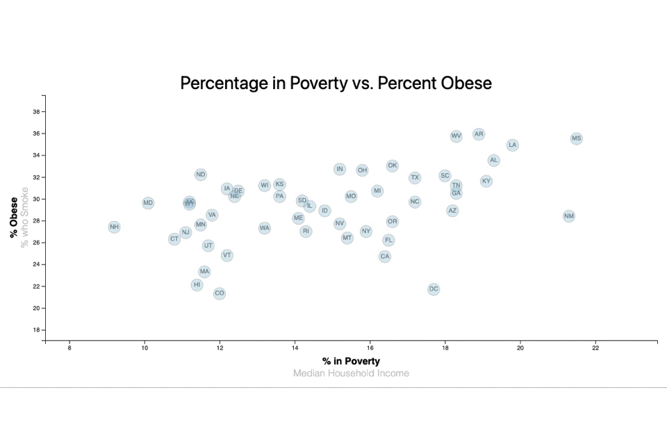

## D3-Challenge

### contains
- D3_data_journalism:
    - index.html: contains html components for the webpage
    - assets:
        - data:
            - data.csv: a CSV file containing data from the US Census Bureau 2014 Census
        - css:
            - d3Style.css: containing stylings for the D3 elements created in JavaScript
            - style.css: contains stylings for the html elements contained in index.html
        - js:
            - app.js: contains code for a responsive scatter plot based on the census data
### description

This project's purpose was to create a scatter plot of information from each US state, derived from the 2014 US Census, which could respond to user interaction by varying one of two variables on each axis; the x-axis could either display median household income or percentage in poverty, and the y-axis could display either percentage of the surveyed who were obese, or percentage of the surveyed who were smokers. Furthermore, the scatter plot circles would display the x and y values chosen when hovered over by the user's mouse. Finally, the graph should resize depending on the page width. The following steps were taken within app.js to achieve this:

- making the page responsive:
    - creating a function that deletes any existing chart (and its containing element, an SVG), draws the chart, basing the chart's containing SVG on a proportion of the window's width and height
    - creating an event listener to note when the page is resized, and triggers the above function
    - calling the function to create the SVG and chart upon page load
- creating an interactive chart
    - creating functions that scale x- and y-axes, render the axes, append a title, and create labelled circles for the scatter plot, all based on a chosen x- and y-axis value
    - setting starting x- and y-axis values for first displaying the chart
    - reading the source data in using d3.csv()
    - calling the functions for initial page load
    - creating event listeners attached to the axis texts that calls an update function, which:
        - updates the x- and y-axis choice values
        - recalls the drawing functions
- having hover text over each scatter plot circle
    - creating a function that updates the tooltip, which takes in the x- and y-axis choice, and returns a text string, which appears on mouseover and disappears on mouseout events
    - calling the function with the other drawing functions under d3.csv()
    - re-calling the function within the update function

### challenges

One difficulty in this project was determining the order of functions. In order to make the chart responsive, all of the code needed to be wrapped in a function. Other functions, such as the one that updates the tooltip, has nested return statements, that would seem to cause exit of the function, but due to the nesting, returns it to the outer function. Finally, some functions are dependant on data that are only read in later. Consequently, the code is not human-reader-intuitive, where reading from the top to the bottom mimics the sequence of events one sees. 

Another difficulty was creating the responsive page size. Just setting the SVG width and height as (related to) the inner width and height of the window would not lead to responsivity, as it sets the width and height upon the initial page size and does not update it. It therefore needs to be a function that is triggered upon page resize, to update the necessary amount of times. This function also needs to be called at the end of the code, so that the function will run when a person visits the page. As mentioned above, the concept of wrapping all of the code in the page resize function seems somewhat unintuitive, as the code within it is mostly about chart creation, not page resizing, and also violates the concept of function modularity, where a function does one thing, not several; however, everything else in the code depends on the SVG size, just as everything in the chart is contained in the SVG element on the page, so all the code does need to be contained within that overarching function.

  
  

*All of the code is wrapped in this makeResponsive() function.*

A final difficulty was the circle text impeding the display of the tooltip hover-text, where the hover-text would only appear around the edge of the circles, where the circle text was not covering the circle. At first, z-index was considered as a solution, to push the hover-text behind the circles in order to make the whole area of the circle available to the tooltip. Upon further research, it was discovered that z-index does not exist within SVGs. Instead the property of SVG that whatever is appended first will be 'under' later elements, was used: appending the labels before the circles themselves, along with giving the circles high transparency, allowed for the labels to be visible, whilst permitting the tooltip hover-text to appear over the whole circle's area. This solution is not optimal, as it depends on having semi-transparent circles, and should be re-visited again. 